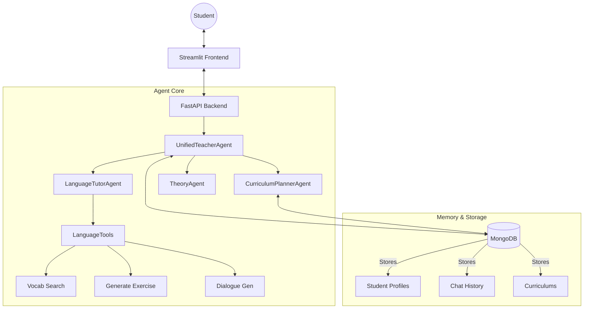

# Personalized Educational Assistant System (PEAS)

## Overview
**PEAS** is a Multi-Agent System (MAS) designed to provide personalized language learning experiences. Unlike traditional static apps, PEAS utilizes a team of autonomous AI agents that collaborate to plan custom curriculums, generate tailored content, tutor students dynamically, and evaluate performance with detailed feedback.

**Course Project:** Machine Learning for Industrial Data (3rd Semester)

**Team:**
* Siraeva Gulnara [PaslenAmari](https://github.com/PaslenAmari)
* Levon Abramian
* Gaibaliev Emil
* [Gleb Mikloshevich](https://github.com/GlebMikloshevich)

---

## 🏗️ System Architecture

### Agent Roles & Responsibilities
The system is orchestrated by a set of specialized agents, each employing Chain-of-Thought reasoning and dynamic tool use:

| Agent | Role | Tools & Capabilities |
|-------|------|----------------------|
| **UnifiedTeacherAgent** | **Orchestrator** | Coordinates content generation, aligns exercises to syllabus, and evaluates chat sessions. Uses `LanguageTools`. |
| **CurriculumPlannerAgent** | **Planner** | Generates 24-week personalized learning paths based on CEFR levels and goals. Stores plans in MongoDB. |
| **LanguageTutorAgent** | **Tutor** | Conducts interactive practice (dialogue, vocab, grammar). Dynamically selects tools based on student error patterns. |
| **AssessorAgent** | **Critic** | detailed analysis of student errors. Provides "Improvement Plans". |
| **TheoryAgent** | **Teacher** | Generates Markdown-formatted theoretical lessons with examples and key takeaways. |

### Architecture Diagram


### Data Flow & Memory
1.  **Short-term Memory:** Context is passed dynamically between agents during active sessions (e.g., passing `student_id` and `current_week` details).
2.  **Long-term Memory:** MongoDB stores persistent data:
    *   **Student Profile:** Goals, Level (A1-C2), Learning Style.
    *   **Curriculum:** The generated weekly plan.
    *   **Chat History:** Past interactions for context-aware tutoring.
    *   **Evaluations:** Progress tracking over time.

---

## 📸 Screenshots

### Landing Page & Profile Creation


### Personalized Learning Plan


### Interactive Exercises


### Level-Up Exams


### Language Selection


---

## 🚀 Installation & Running

### Prerequisites
-   [Docker](https://www.docker.com/) and Docker Compose installed.
-   OR Python 3.10+ (for local manual run).

### Option 1: Docker (Recommended)
You can run the entire system (Database + API + UI) with a single command. This ensures all dependencies and the database are configured correctly.

1.  **Build and Run:**
    ```bash
    docker-compose up --build
    ```
2.  **Access Services:**
    *   **Web UI:** [http://localhost:8501](http://localhost:8501)
    *   **API Docs:** [http://localhost:8000/docs](http://localhost:8000/docs)

### Option 2: Manual Local Setup
If you want to run components individually for development:

1.  **Start MongoDB:**
    ```bash
    docker run -d --name kursach_mongo -p 27017:27017 mongo:6
    ```
2.  **Install Dependencies:**
    ```bash
    pip install -r requirements.txt
    ```
3.  **Run API Backend:**
    ```bash
    uvicorn src.api.main:app --reload --port 8000
    ```
4.  **Run UI Frontend:**
    ```bash
    streamlit run src/ui/app.py
    ```

---

## 🛠️ Configuration
The system uses `python-dotenv` or environment variables for configuration. API keys (e.g., OpenAI, Anthropic) should be set in a `.env` file or passed via Docker environment variables if you are connecting to real LLMs (currently configured for mock/local execution).

```env
# Example .env
MONGODB_URL=mongodb://localhost:27017
OPENAI_API_KEY=sk-...
```

---

## 🔧 API Usage
The internal **FastAPI** service exposes agent capabilities. You can interact with it directly via Swagger UI (`/docs`).

**Example: Generate an Exercise**
```json
POST /generate/exercise
{
  "week": 1,
  "type": "multiple_choice",
  "difficulty": 2
}
```

**Example: Dynamic Tool Selection**
```http
GET /tools/select?level=1&topic=Greetings
```
